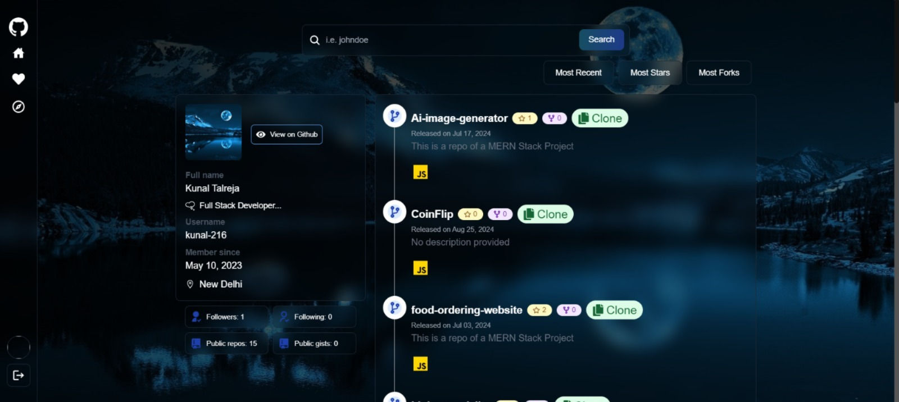
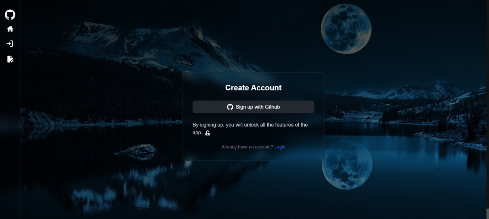
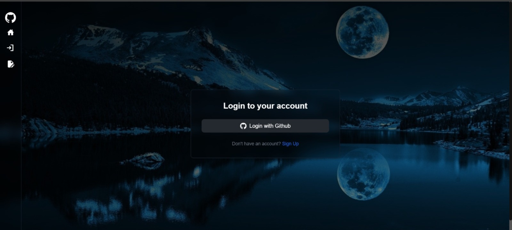
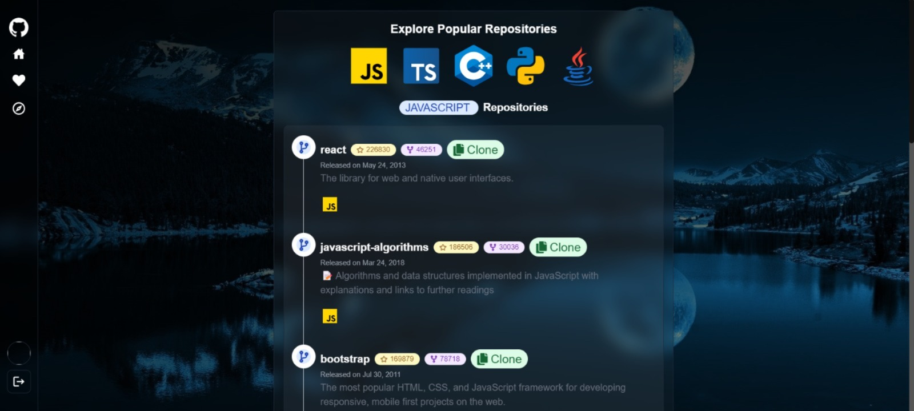
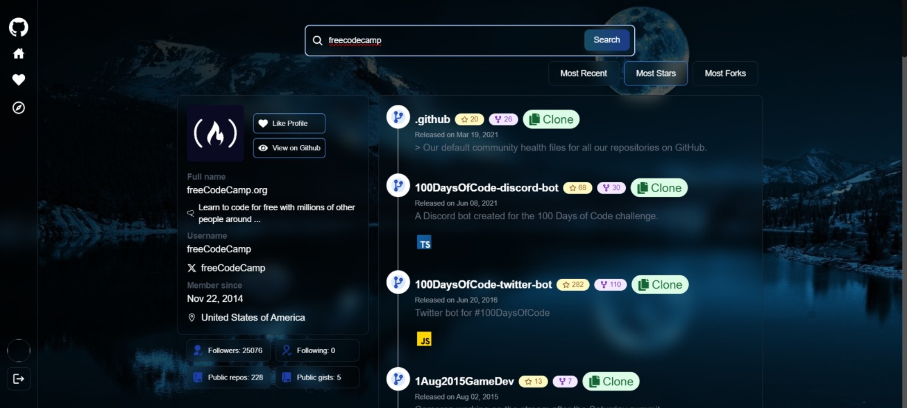
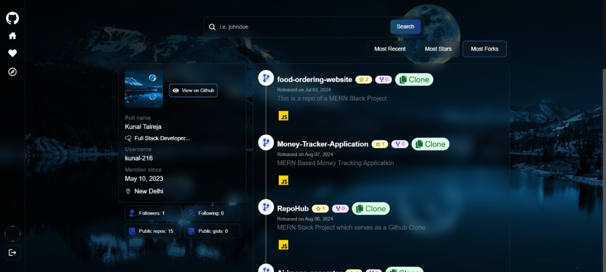
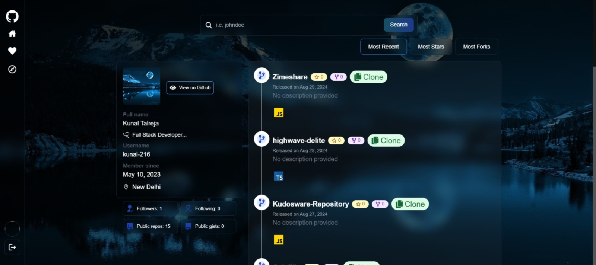
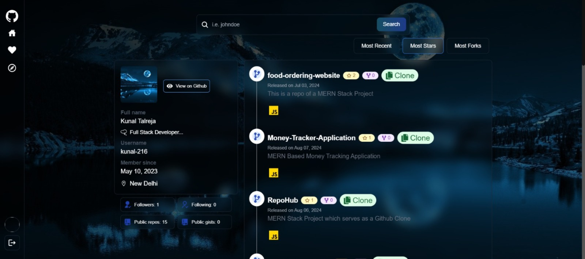

# RepoHub - GitHub Repository Management Application

## Project Overview

**RepoHub** is a powerful web application designed to streamline GitHub repository management. It offers features for authentication, repository management, profile exploration, and more, all integrated with the GitHub API. Users can manage their own repositories, explore others, and find popular repositories in various programming languages.

## Pages

### Home Page

- **Description**: The landing page of the application featuring an overview and navigation to other pages.
- **Image**: 

### Signup Page

- **Description**: Allows users to sign up using GitHub OAuth.
- **Image**: 

### Login Page

- **Description**: Provides login functionality using GitHub OAuth.
- **Image**: 

### Explore Popular Repos Page

- **Description**: Displays a list of popular repositories in various programming languages.
- **Image**: 


## Features

### Authentication

- **GitHub OAuth Login and Signup**: Secure login and signup using GitHub OAuth.
- **Manage Your Repositories**: Access and manage your own repositories with ease.

### Profile Management

- **View and Like Profiles**: See profiles of other GitHub users and like their profiles.
- **Search Users**: Find other GitHub users by their username.
- **View User Profiles**: Access profiles and repositories of searched users using their usernames.
- **Image**: 

### Repository Management

- **Explore Repositories**: Browse repositories filtered by:
  - **Most Forks**: 
  - **Most Recent**: 
  - **Most Stars**: 
- **Clone Repository URL**: Easily clone repositories using their URL.
- **Explore Popular Repositories**: Discover popular repositories in languages such as JavaScript, TypeScript, Java, and more.


## Tech Stack

- **Frontend**: React.js
- **Backend**: Node.js, Express.js
- **Database**: MongoDB
- **API**: GitHub API

## Installation Instructions

Follow these steps to set up the project locally:

1. **Clone the Repository**:
   ```bash
   git clone [repository-url]
   ```

2. **Navigate to the Project Directory**:
   ```bash
   cd RepoHub
   ```

3. **Frontend Setup**:
   - Navigate to the frontend directory:
     ```bash
     cd frontend
     ```
   - Install dependencies:
     ```bash
     npm install
     ```
   - Start the frontend development server:
     ```bash
     npm start
     ```

4. **Backend Setup**:
   - Navigate to the backend directory:
     ```bash
     cd backend
     ```
   - Install dependencies:
     ```bash
     npm install
     ```
   - Start the backend server using:
     ```bash
     nodemon server.js
     ```

5. **Database Setup**:
   - Ensure MongoDB is installed and running.
   - Configure the MongoDB connection in the backend configuration files.

6. **GitHub API Configuration**:
   - Obtain a GitHub OAuth token and configure it in the backend to enable authentication and API access.

## Usage

- **For Users**: 
  - Use the Signup page to register via GitHub OAuth.
  - Log in through the Login page.
  - Manage your repositories, explore others' profiles, and search for users and their repositories by visiting the Home Page and Explore Popular Repos Page.
